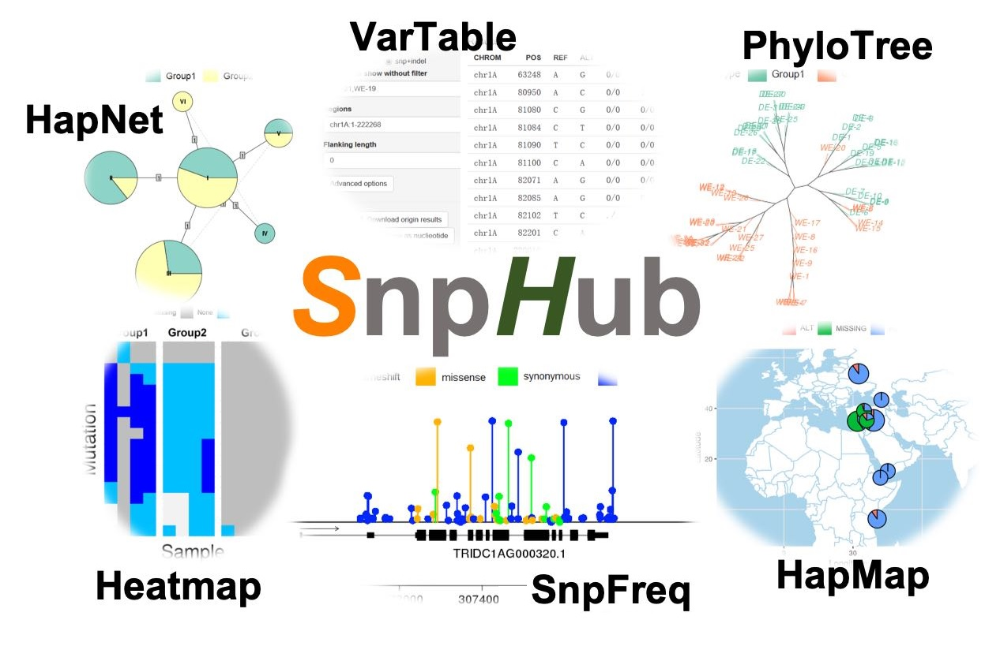

# snphub

SnpHub is a Shiny-based server framework for retrieving, analyzing and visualizing the large genomic variations data in a lab.

For more **details**, check [here](https://esctrionsit.github.io/snphub_tutorial/)

For **Docker-encapsulated version**, check [here](https://github.com/esctrionsit/snphub4docker)

To get a **quick start**, see [here](https://esctrionsit.github.io/snphub_tutorial/content/Setup/quickstart.html)

[Here](http://wheat.cau.edu.cn/Wheat_SnpHub_Portal/) are our **live demos**.

## Environment request

To run the SnpHub, make sure these softwares are **already** installed:
- samtools
- bcftools
- seqkit
- tabix

Alse, these R packages are also **needed**:
- ggplot2
- ggmap
- dplyr
- rjson
- shiny
- pegas
- maps
- vcfR
- ape
- DT

## Config file

There are two config files, which are `setup_config.R` and `advanced_config.R`.

To try our web platform, download the code and put then in your `shiny server app folder` is all you need to do.

To use the setup function, you would need to:
- Edit the `setup_config.R` file, make sure all the paths are correct.
- Delete the `advanced_config.R`, and rename the `advanced_config_O.R` as `advanced_config.R`.
- Use shell code such as `Rscript setup.R` to setup your source data.
- Once the setup finished, you can turn to your browser to visit it.